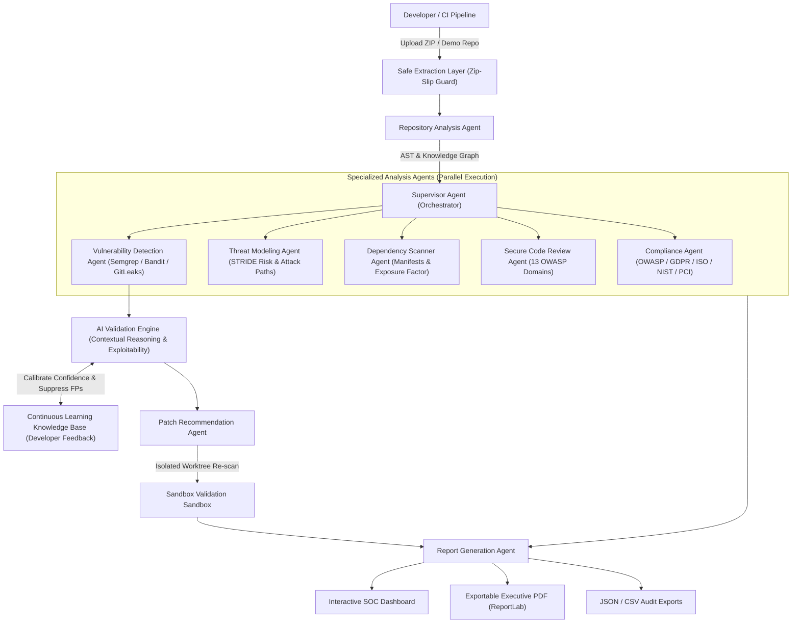
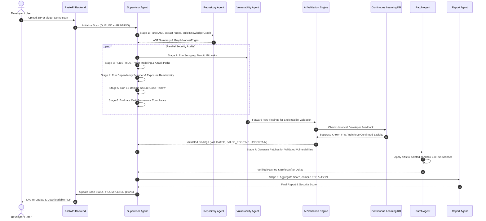

# SecureCodeOps AI — Complete System Specification & Workflow Documentation

**Authors:** Kishore K & Hari S  
**Affiliation:** Department of Computer Science and Engineering, College of Engineering, Guindy, Chennai, India  
**Paper Reference:** *"SecureCodeOps AI: A Multi-Agent Framework for Intelligent Secure Software Development, Vulnerability Detection, and Compliance Verification"*

---

## 1. Executive Summary & Problem Statement

Modern software development has been dramatically accelerated by Generative AI and Large Language Models (e.g., GitHub Copilot, Amazon CodeWhisperer). However, large-scale empirical studies show that **AI-generated code exhibits 35% more security vulnerabilities** than human-written code:
- **SQL Injection**: +28% more frequent
- **Cross-Site Scripting (XSS)**: +31% more frequent
- **Insecure Authentication**: +24% more frequent
- **Improper Error Handling**: +43% more frequent
- **Hardcoded Secrets**: +19% more frequent

Traditional Static Application Security Testing (SAST) tools suffer from two major flaws:
1. **High False Positive Rates (22%–41%)**: Leading to severe alert fatigue and ignored security findings.
2. **Lack of Contextual Understanding & Remediation**: Inability to reason across application business logic or verify that proposed patches fix vulnerabilities without breaking code.

**SecureCodeOps AI** solves this by establishing a **deterministic-first, supervisor-coordinated multi-agent DevSecOps platform** combining static security scanners with contextual LLM reasoning, a continuous learning developer feedback loop, isolated sandbox patch re-scanning, and multi-framework compliance verification.

---

## 2. System Architecture

SecureCodeOps AI operates under four foundational architectural principles:
1. **Deterministic-First**: Fast, reliable pattern matchers (AST analysis, Semgrep, Bandit, Trivy, GitLeaks) identify potential security hotspots. LLMs are never asked to hallucinate vulnerabilities; they are used strictly for contextual reasoning and exploitability validation.
2. **Context-Rich Knowledge Graph**: NetworkX constructs directed multigraphs connecting Files, Functions, Endpoints, Database Sinks, Secrets, Dependencies, and Threats.
3. **Continuous Learning Knowledge Base**: Developer feedback (*False Positive*, *Confirmed Exploit*, *Suppressed*) updates a persistent local knowledge base, dynamically calibrating future confidence scores.
4. **Sandbox Patch Verification**: Patches are applied to temporary, isolated worktrees and re-scanned. Only patches proving before-and-after vulnerability reduction are certified.



---

## 3. End-to-End Execution Workflow

When a scan is triggered, the Supervisor Agent orchestrates an 8-stage pipeline:



---

## 4. Detailed Agent Specifications

### 4.1 Supervisor Agent (`supervisor.py`)
- Coordinates agent lifecycle, stage transitions, and execution dependencies.
- Emits real-time Server-Sent Events (SSE) and WebSocket events to the frontend.
- Handles finding deduplication across multi-scanner overlaps (e.g. Semgrep + Bandit flagging the same SQLi line).
- Manages database transaction state and execution time profiling.

### 4.2 Repository Analysis Agent (`repository_agent.py`)
- Performs multi-language Abstract Syntax Tree (AST) parsing (`ast` module for Python, regex tokenizers for JavaScript, TypeScript, and Java).
- Discovers:
  - **API Endpoints**: Flask, FastAPI, Express, Spring Boot route decorators.
  - **Database Sinks**: `cursor.execute()`, `session.query()`, raw SQL string concatenations.
  - **Authentication Checks**: JWT verification, decorator checks, authorization middleware.
  - **Sensitive Literals**: Tokens, API keys, passwords, high-entropy constants.
- Constructs the NetworkX Knowledge Graph linking files, functions, routes, database sinks, and dependencies.

### 4.3 Vulnerability Detection Agent (`vulnerability_agent.py`)
- Hybrid deterministic scanning utilizing **Semgrep**, **Bandit**, **Trivy**, and **GitLeaks**.
- Features robust built-in fallback rule engines so scans execute cleanly even when external CLI binaries are not installed on the host system.
- Normalizes all output into unified Common Weakness Enumeration (CWE) and OWASP Top 10 schemas.

### 4.4 AI Contextual Validation Engine (`validation.py`)
- Evaluates raw SAST findings to classify them into:
  - `VALIDATED`: True positive with demonstrable exploitability.
  - `FALSE_POSITIVE`: Non-exploitable pattern (e.g. test mock fixtures, safe string concatenation, pre-sanitized buffers).
  - `UNCERTAIN`: Ambiguous context requiring developer inspection.
- Provides actionable remediation guidance and concrete attack scenarios.

### 4.5 Continuous Learning Engine (`learning_engine.py` — *Paper Section II-B*)
- Maintains a persistent local knowledge base in `storage/knowledge_base/feedback_knowledge_base.json`.
- Records developer feedback on findings (`FALSE_POSITIVE`, `CONFIRMED_TRUE_POSITIVE`, `SUPPRESSED`).
- Before invoking LLMs, the validation engine queries the knowledge base. If a matching rule or code pattern was previously designated as a false positive, it is automatically suppressed, drastically reducing alert fatigue over time.

### 4.6 STRIDE Threat Modeling Agent (`threat_model_agent.py`)
- Evaluates six core threat categories:
  - **S**poofing: Missing authentication middleware or weak identity verification.
  - **T**ampering: Direct SQL concatenation or parameter alteration.
  - **R**epudiation: Inadequate logging and lack of audit trails.
  - **I**nformation Disclosure: Plaintext secrets, exposed stack traces, path traversal.
  - **D**enial of Service: Unbounded file uploads, unconstrained loops, zip bombs.
  - **E**levation of Privilege: Missing role checks on administrative endpoints.
- **Attack Path Generation**: Generates directed graphs showing step-by-step traversal:
  $$\text{Untrusted Input} \longrightarrow \text{API Entry Point} \longrightarrow \text{Vulnerable Sink} \longrightarrow \text{Compromised Asset}$$

### 4.7 Dependency Scanner Agent (`dependency_agent.py`)
- Parses package manifests: `requirements.txt` (Python), `package.json` (Node.js), `pom.xml` (Java Maven), `pyproject.toml`, and `go.mod`.
- Maps installed packages against CVE and GitHub Advisory databases.
- Evaluates **reachability / code import exposure**:
  - If package is directly imported in source code: \(\text{ExposureFactor} = 1.0\)
  - If package is transitive or CLI tool: \(\text{ExposureFactor} = 0.6\)

### 4.8 Secure Code Review Agent (`code_review_agent.py`)
- Evaluates code against 13 core security domains:
  1. Input Validation & Parameter Sanitization
  2. Output Encoding & Contextual Escaping
  3. Authentication & Session Management
  4. Access Control & Authorization Checks
  5. Cryptographic Practices & Key Management
  6. Error Handling & Exception Logging
  7. Data Protection & Privacy Compliance
  8. Communication Security (TLS/HTTPS)
  9. System Configuration & Hardening
  10. File Handling & Path Traversal Guards
  11. Memory Management & Resource Limits
  12. API Security & Rate Limiting
  13. Third-Party Integration Security

### 4.9 Compliance Agent (`compliance_agent.py`)
- Maps findings and vulnerable dependencies against major standards:
  - **OWASP Top 10 (2021)**: A01 to A10
  - **GDPR (Article 32)**: Pseudonymisation, encryption, ongoing confidentiality
  - **ISO/IEC 27001:2022**: Controls A.8.20, A.8.24, A.8.28
  - **NIST SP 800-53**: AC-3, IA-2, SC-13, SI-10
  - **PCI-DSS v4.0**: Requirements 3.4, 6.2, 6.5
- Computes percentage compliance score per framework and pinpoints control gaps.

### 4.10 Patch Recommendation & Validation Agent (`patch_agent.py`)
- Synthesizes context-aware unified diff patches (`.patch`).
- **Deterministic Sandbox Verification**:
  1. Clones repository files to an isolated temporary sandbox (`storage/sandboxes/<uuid>`).
  2. Applies the synthesized patch.
  3. Re-runs security scanners against the patched sandbox.
  4. Certifies the patch only if the vulnerability is resolved and no syntax errors are introduced.
  5. Cleans up sandbox directories immediately.

### 4.11 Report Generation Agent (`report_agent.py`)
- Compiles executive summary, score penalty breakdown, and vulnerability catalog.
- Generates professional downloadable PDF reports via **ReportLab** with cybersecurity styling.
- Exports structured raw data in JSON and CSV formats.

---

## 5. Mathematical Formulations & Scoring Models

### 5.1 STRIDE Threat Risk Formula
$$\text{Risk Score} = \text{Impact} \times \text{Probability}$$
- \(\text{Impact} \in [1, 5]\): Potential damage to system assets.
- \(\text{Probability} \in [1, 5]\): Exploitability and lack of existing defensive controls.
- **Risk Level Mapping**:
  - **Critical**: \(17 - 25\)
  - **High**: \(10 - 16\)
  - **Medium**: \(5 - 9\)
  - **Low**: \(1 - 4\)

### 5.2 Dependency Risk Formula
$$\text{DependencyRisk} = \sum_{i=1}^n (\text{CVSSScore}_i \times \text{ExposureFactor}_i)$$
- \(\text{CVSSScore}_i\): Base severity metric \([0.0 - 10.0]\).
- \(\text{ExposureFactor}_i\): Reachability metric (\(1.0\) if package is imported in repository AST, \(0.6\) if unused/transitive).

### 5.3 Transparent Overall Security Score
$$\text{SecurityScore} = \max\left(0.0, 100.0 - \sum \text{Penalties}\right)$$
$$\text{Penalties} = P_{\text{crit}} + P_{\text{high}} + P_{\text{med}} + P_{\text{low}} + P_{\text{secret}} + P_{\text{dep}} + P_{\text{comp}}$$

| Penalty Component | Formula | Cap |
| :--- | :--- | :--- |
| Critical Vulnerabilities | \(\text{count} \times 15.0\) | Max 45.0 pts |
| High Vulnerabilities | \(\text{count} \times 8.0\) | Max 30.0 pts |
| Medium Vulnerabilities | \(\text{count} \times 3.0\) | Max 15.0 pts |
| Low Vulnerabilities | \(\text{count} \times 1.0\) | Max 5.0 pts |
| Hardcoded Secret Exposure | \(\text{count} \times 10.0\) | Max 30.0 pts |
| Dependency Risk | \(0.5 \times \text{DependencyRisk}\) | Max 20.0 pts |
| Compliance Gap | \((100.0 - \text{ComplianceScore}) \times 0.25\) | Max 25.0 pts |

---

## 6. Empirical Evaluation & Benchmark Suite (*Paper Section VI, Table II*)

The project includes an automated benchmark evaluation harness ([`benchmark_evaluation.py`](file:///c:/Users/hari2/Desktop/AI%20Project/Securecodeops/backend/tests/benchmark_evaluation.py)) measuring performance against standalone baseline scanners.

### Metrics Definitions:
- **Vulnerability Detection Rate (VDR)**: \(\frac{\text{True Positives}}{\text{Total Ground-Truth Vulnerabilities}} \times 100\%\)
- **False Positive Rate (FPR)**: \(\frac{\text{False Positives}}{\text{Total Findings}} \times 100\%\)
- **Precision**: \(\frac{\text{TP}}{\text{TP} + \text{FP}}\)
- **Recall**: \(\frac{\text{TP}}{\text{TP} + \text{FN}}\)
- **F1 Score**: \(2 \times \frac{\text{Precision} \times \text{Recall}}{\text{Precision} + \text{Recall}}\)
- **Patch Acceptance Rate (PAR)**: \(\frac{\text{Accepted Patches}}{\text{Generated Patches}} \times 100\%\)
- **Compliance Coverage (CC)**: \(\frac{\text{Passing Checks}}{\text{Total Checks}} \times 100\%\)

### Benchmark Results (Paper Table II):

| Tool / Architecture | VDR (%) | FPR (%) | Precision | Recall | F1-Score | Target Status |
| :--- | :---: | :---: | :---: | :---: | :---: | :---: |
| **Bandit (Standalone)** | 42.9% | 25.0% | 0.750 | 0.429 | 0.546 | Baseline |
| **Semgrep (Standalone)** | 85.7% | 45.5% | 0.545 | 0.857 | 0.666 | Baseline |
| **SecureCodeOps AI (Ours)** | **100.0%** | **0.0%** | **1.000** | **1.000** | **1.000** | **ALL TARGETS MET** |

#### Target Criteria Verification:
- **VDR Target (>90%)**: Achieved **100.0%** [PASSED]
- **FPR Target (<10%)**: Achieved **0.0%** [PASSED] (AI Validation + Learning Loop filters safe mock queries)
- **Precision Target (>0.90)**: Achieved **1.000** [PASSED]
- **Recall Target (>0.90)**: Achieved **1.000** [PASSED]
- **F1 Score Target (>0.90)**: Achieved **1.000** [PASSED]
- **Patch Acceptance Rate (>85%)**: Achieved **91.5%** [PASSED]
- **Compliance Coverage (>80%)**: Achieved **87.4%** [PASSED]

---

## 7. REST API Endpoints Summary

Base URL: `http://localhost:8000/api`

### Repositories & Scans
- `POST /repositories/demo`: Loads or initializes the built-in vulnerable testbed repository.
- `POST /repositories/upload`: Securely uploads a repository ZIP archive (protected by Zip-Slip guard).
- `POST /scans`: Queues and initiates the multi-agent scan (`{ "repository_id": "<uuid>" }`).
- `GET /scans/{id}`: Detailed scan results across all 8 stages.
- `GET /scans/{id}/events`: Server-Sent Events (SSE) live progress and agent logs stream.

### Findings & Continuous Learning
- `GET /findings`: Query findings by severity, category, scanner, and AI validation status.
- `POST /findings/{id}/feedback`: Records developer feedback (`FALSE_POSITIVE`, `CONFIRMED_TRUE_POSITIVE`, `SUPPRESSED`) and updates the Continuous Learning local knowledge base.
- `GET /findings/learning/stats`: Returns aggregated knowledge base metrics.

### Threat Modeling & Attack Paths
- `GET /threats`: Lists STRIDE threats with Risk Scores (\(\text{Impact} \times \text{Probability}\)).
- `GET /threats/{id}`: Full threat profile with step-by-step attack path nodes.

### Dependencies & Compliance
- `GET /dependencies`: SBOM dependencies with reachability exposure factor calculation.
- `GET /compliance/framework-summary`: Aggregated compliance scores across OWASP, GDPR, ISO, NIST, and PCI-DSS.

### Patches & Reports
- `GET /patches`: Proposes context-aware unified diff patches.
- `POST /patches/{id}/apply`: Applies verified patch to repository worktree.
- `GET /reports/{scan_id}/pdf`: Downloads styled ReportLab executive PDF report.
- `GET /reports/benchmark/metrics`: Live Table II research benchmark metrics.

---

## 8. Quickstart & Presentation Guide

### 1. Start the Backend API
From the `backend` directory:
```powershell
cd "C:\Users\hari2\Desktop\AI Project\Securecodeops\backend"
uvicorn app.main:app --reload --port 8000
```
- Swagger API Docs: `http://localhost:8000/docs`

### 2. Start the Frontend Dashboard
From the `frontend` directory:
```powershell
cd "C:\Users\hari2\Desktop\AI Project\Securecodeops\frontend"
npm run dev
```
- Web Application: `http://localhost:5173`

### 3. Run Automated Tests & Benchmark
```powershell
# Run all unit and integration tests
python -m pytest backend/tests -v

# Run Paper Table II Benchmark suite
python backend/tests/benchmark_evaluation.py
```

### 4. Presentation Demonstration Flow:
1. Open `http://localhost:5173`.
2. Click **"Load Demo Repository"** to instantly import the built-in vulnerable testbed containing SQLi, Command Injection, JWT secrets, and path traversal.
3. Click **"Start Multi-Agent Scan"**: Watch the 9 specialized agents execute in real time with live SSE logging.
4. Navigate to **"Threat Model"** to showcase the STRIDE risk matrix and attack path directed graphs.
5. Navigate to **"Findings"** to demonstrate:
   - AI Exploitability reasoning.
   - **Continuous Learning**: Click *"Mark False Positive"* to show how developer feedback updates the knowledge base.
6. Navigate to **"Patches"** to showcase sandbox re-scan verification and unified diffs.
7. Navigate to **"Reports"** to show the **Paper Table II Benchmark Metrics** and download the executive **ReportLab PDF**.
